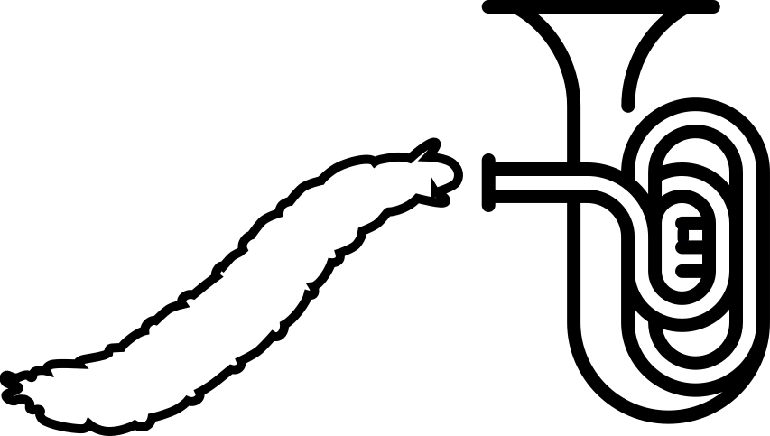

<p align="center">
    
</p>

# MaggotUBA : Drosophila Larva Unsupervised Behavior Analysis

## Quickstart - using the maggotuba command line tool

At the moment the pipeline is limited to the analysis of "Point dynamics" time series, which track the coordinates of 5 points along the longitudinal axis of the larva.

We assume your data is stored in a folder with the following structure :

```folder tree
raw_data_dir
├── t_5
│   ├── LINE_1
│   │   ├── protocol_1
│   │   │   ├── date_time1
│   │   │   │   ├── Point_dynamics_t5_LINE_1_protocol_1_larva_id_date_time1_larva_number_xx.txt
│   │   │   │   └──...
│   │   │   └── date_time2
│   │   │   └── date_time3
│   │   └──protocol_2
│   │   └──protocol_3
│   └── LINE_2
│   │   └──...
│   └── LINE_3
│       └──...
└── t_15
    └── ...
```

If the data is not recorded as Point_dynamics files, the script `point_dynamics_from_trx` is provided to construct them from `trx.mat` files. This takes a bit of time ; do it once and for all !

UPDATE : In order to be able to display the outlines, we now also assume that the `trx.mat` files are available in a similar folder structure. See step 4. bis.

Most scripts support local multiprocessing. We recommend using a beefy desktop computer or a HPC cluster node and setting the parameters `N` or `n_workers` to several dozens. 

1. Create a project folder and `cd` into it.

```bash
maggotuba setup path/to/raw_data_dir path/to/project --len_traj LEN_TRAJ
cd path/to/project
```

2. Optionally, update parameters in `config.json`

3. Count the proportion of each behavior in the database :
 ```bash
 maggotuba db count --n_workers n_workers
 ```

4. Create a balanced database :
```bash
maggotuba db build --n_workers n_workers
```

4. bis. Create the corresponding outline database, for use in the clustering GUI :
```bash
maggotuba db outlines --n_workers n_workers
```

5. Train an autoencoder :
```bash
maggotuba model train --name experiment
```

6. Evaluate it :
```bash
maggotuba model eval --name experiment
```

7. Optionally, examine clusters in the latent space :
```bash
maggotuba model cluster --name experiment
```

8. Compute the embeddings for the whole database.
```bash
maggotuba model embed --name experiment --n_workers n_workers
```

9. Compute the MMD matrix for a particular tracker
```bash
maggotuba model compute_mat --name experiment --tracker t5 --n_workers n_workers
```

10.  Detect hits for a particular set of experiments using MMD statistical testing.
```bash
maggotuba mmd find_hits --root experiment
```
At the moment hits are detected for `t5`, `GMR` lines, `UAS_TNT_2_0003` effector, under the protocol `p_8_45s1x30s0s#p_8_105s10x2s10s#n#n@100`.

Options exist to distribute the computations to a SLURM cluster.

11. Some helper functions are provided to write notebooks related to a particular model under `maggotuba.notebook`. For it to work as expected, the notebooks should be saved at the top level of the corresponding project folder. They are provided as a way to reduce boilerplate code.